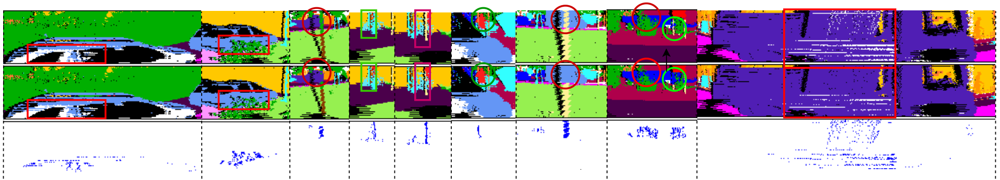

# Contextual Range-View Projection for 3D LiDAR Point Clouds

Code and scripts for the paper:

**Contextual Range-View Projection for 3D LiDAR Point Clouds**  
*Seyedali Mousavi, Seyedhamidreza Mousavi, Masoud Daneshtalab*  
Mälardalen University

---

## Overview
Range-view projection converts LiDAR point clouds into 2D images, but the standard depth-based approach keeps only the closest point, often losing object structure. We introduce two simple extensions:

- **Centerness-Aware Projection (CAP):** favors points near object centers.  
- **Class-Weighted Projection (CWAP):** emphasizes or down-weights semantic classes.  

On SemanticKITTI, these refinements improve instance-level segmentation by up to **+3.1% mIoU**.

<p align="center">
  
  <br>
  <em>Figure 1. Effect of Centerness-Aware Projection (CAP) vs. standard depth-based projection on range image formation.</em>
</p>

---

## Setup
1. Download [SemanticKITTI](http://www.semantic-kitti.org/) and place it under:
```

kitti_dataset/dataset/sequences/

````
2. Install requirements:
```bash
pip install -r requirements.txt
````

---

## Usage

First generate auxiliary data:

```bash
python create_centers.py
python generate_weights.py
```

Then run comparison:

```bash
python compare.py --sequence 00 --dataset kitti_dataset/dataset --labels labels
```

Replace `00` with the desired KITTI sequence.

Before running, open `compare.py` and set the following lines:

```python
scan_b = SemLaserScan(color_dict, project=True, scan_proj=True, use_center=True, use_weight=False)
scan_a = SemLaserScan(color_dict, project=True, scan_proj=True, use_center=False, use_weight=False)
```

Here:

* `scan_proj=True` → scan unfolding (False → spherical projection)
* `use_center=True` → enable CAP
* `use_weight=True` → enable CWAP
* Both `False` → standard depth-based projection

---

## Repository

```
.
├── auxiliary/              # Helper scripts
├── kitti_dataset/dataset/  # Place SemanticKITTI here
├── compare.py              # Main script
├── create_centers.py       # Generate centerness scores
└── generate_weights.py     # Generate weights
```

